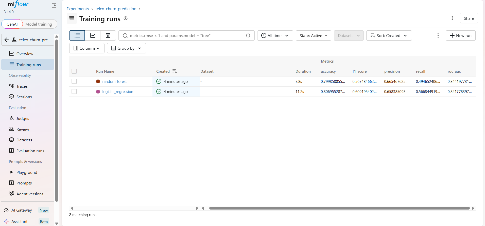
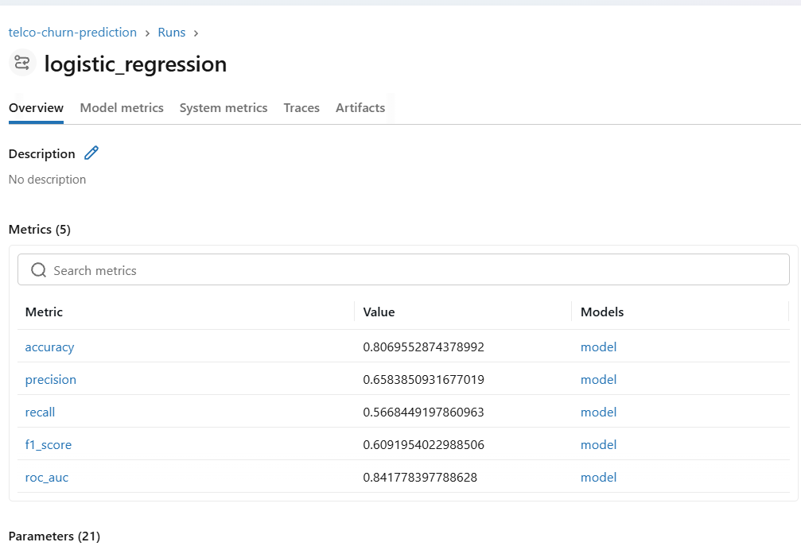

# 📊 Telco Customer Churn Prediction
## Project Report - MLOps & System Design

**Team Members:** 
- Alejandro Hernandez
- Mauricio Zambrano
- Syed Mahmoud

**Date:** June 24, 2026
**Course:** EADA Business School

---
## 1. Problem Statement

### Problem Description
Telecommunications companies lose a significant portion of their revenue due to customer churn. Detecting in advance which customers are at high risk of cancelling their service allows the company to act proactively (retention offers, sales outreach, service improvements) before losing the customer.

The project objective is to build a training pipeline that predicts, based on a customer's demographic, contract, and usage data, the probability that they will churn.

### Problem Type
Binary classification. The target variable is `Churn` (Yes/No).

### Dataset
- **Source:** Telco Customer Churn (IBM), also widely used on Kaggle. It is a static `.csv` file downloaded once and versioned in `datasets/telco_churn.csv`.
- **Size:** 7,043 customers, 21 columns (20 features + target).
- **Variables:** demographic data (gender, senior citizen, partner/dependents), tenure, subscribed services (phone, internet, online security, tech support, streaming…), contract type, payment method, and monthly/total charges.

### System Design Decisions
- **Data acquisition:** static CSV file, not an API. For this use case (periodic training of a retention model), real-time data is not required; periodic retraining (e.g., weekly/monthly) suffices as new customer records and churn status accumulate.
- **Allowed latency:** high tolerance for training latency (it is a batch process, not online). For prediction, however, near-immediate response (seconds) is expected, since the use case is batch scoring of the customer portfolio (on-demand workflow), not a real-time customer-facing prediction.
- **Retraining:** automated via CD (push to main), so that any change in preprocessing/training code regenerates the model without manual intervention.
- **Identity of input/output data:** `customerID` is used only as a reference for the prediction report, never as a model feature (it carries no predictive signal and prevents information leakage).

---
## 2. Model Development

### Preprocessing
- `TotalCharges` comes as text, with blank values for customers with `tenure = 0` (new customers with no billing yet). Converted to numeric and imputed with 0.
- `customerID` is dropped (identifier, no predictive value).
- Categorical variables encoded with one-hot encoding (`pd.get_dummies`, `drop_first=True` to avoid collinearity).
- Stratified 80/20 train/test split (the target is moderately imbalanced: ~26.5% churn).

### Evaluated Models
Following the project brief's recommendation to avoid over-complicated architectures, two simple and well-known models were evaluated:

| Model | Accuracy | Precision | Recall | F1-score | ROC-AUC |
|---|---|---|---|---|---|
| Logistic Regression | 0.807 | 0.658 | 0.567 | 0.609 | 0.842 |
| Random Forest | 0.800 | 0.665 | 0.495 | 0.567 | 0.844 |

*(Logistic Regression with `StandardScaler` in a pipeline; Random Forest with `n_estimators=150`, `max_depth=8`. Metrics on the test set, 20% of the data, stratified split.)*

### Chosen Model: Logistic Regression
- Best F1-score, with a better balance between precision and recall than Random Forest (which sacrifices recall, i.e., lets more churning customers slip through).
- For a retention business case, recall matters: it is more costly not to detect a customer who will leave than to contact someone who would actually stay.
- Interpretable model: the coefficients allow the business to understand which variables increase churn risk (e.g., month-to-month contract, low tenure), something Random Forest does not offer as directly.
- ROC-AUC is practically equivalent between the two models (0.842 vs 0.844), so the difference does not justify sacrificing interpretability and F1-score.

### Experiment Tracking with MLflow

All runs (one run per model, with their hyperparameters and metrics) are logged in the MLflow experiment named `telco-churn-prediction`, by running:

```bash
mlflow ui --backend-store-uri sqlite:///mlflow.db
```

**Comparison of runs in MLflow UI:**



**Detail of the winning run (logistic_regression):**



---
## 3. Conclusions

The project implements a complete MLOps pipeline for predicting telecom customer churn:

- **Problem:** binary classification on static tabular data.
- **Pipeline:** centralised preprocessing in `src/preprocessing.py`, reused in both the experimentation notebook and in training (CD) and on-demand prediction, avoiding duplicated logic and ensuring consistency between training and inference.
- **Tracking:** MLflow logs every experiment, allowing objective and reproducible model comparison.
- **Final model:** Logistic Regression, with F1-score 0.609 and ROC-AUC 0.842, prioritised for its interpretability and better precision/recall balance over Random Forest.
- **Automation:** CI runs tests on every pull request; CD retrains and versions the model on each push to main; the on-demand workflow allows batch predictions on new customers without retraining.
- **Outcome:** an end-to-end reproducible system —from raw data to prediction— that can be run with a single command (`python main.py train` / `python main.py predict`) on any reviewer's machine.

### Limitations and Possible Future Improvements
- The dataset is moderately imbalanced; techniques like class-weighting or SMOTE could improve recall without sacrificing too much precision.
- No extensive hyperparameter search was performed (deliberately, to keep the model simple), which leaves room for marginal metric improvements.
- The system assumes static data; if a dynamic source were integrated in the future (e.g., the company's CRM API), the same preprocessing pipeline would be reusable without changes.